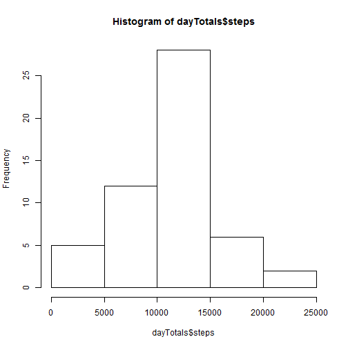
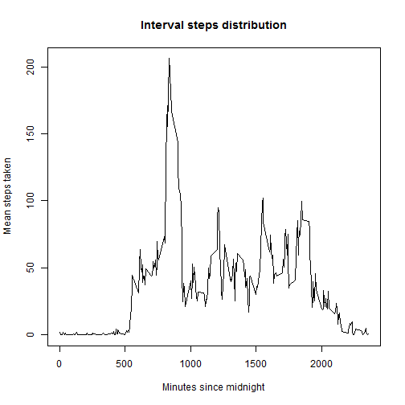
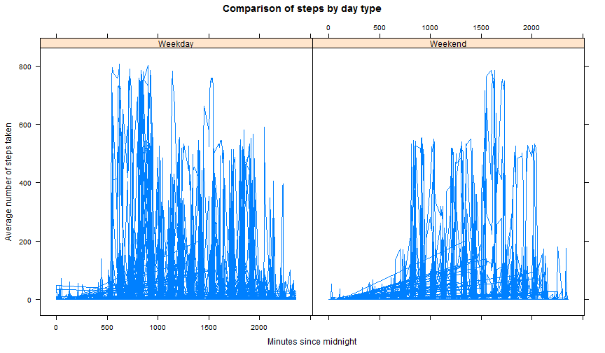

# Reproducible Research: Peer Assessment 1

## Purpose
Analyze data collected by personal monitoring devices that track the number of steps taken in five minute intervals. Use the data to answer a series of exploratory questions about step distributions.

## Environment
This analysis was performed in the following environment:

```r
v <- R.Version();
i <- Sys.info();
v <- paste(v$version.string, "-", v$nickname, sep = " ");
os <- paste(i["sysname"], i["release"], i["version"], sep = " ");
```
* R Version: R version 3.0.3 (2014-03-06) - Warm Puppy
* Operating System: Windows 7 x64 build 7601, Service Pack 1

No other software was used in the analysis.

## Loading and preprocessing the data
The first step in the analysis is to load the data into R. The data can be found in the [GitHub repository](https://github.com/Matt-Nelson/RepData_PeerAssessment1) for this analysis.

Download the zip file and extract the contents into an ActivityData directory.

```r
# Set Internet2 - required for https URLs on Windows OS
setInternet2(use = TRUE);
# Generate an unused filename and download the zip to it.
temp <- tempfile();
download.file("https://github.com/Matt-Nelson/RepData_PeerAssessment1/raw/master/activity.zip", temp);

# Read the data into memory then delete the temporary file.
data <- read.csv(unz(temp, "activity.csv"));
unlink(temp);
```

Next, we need to convert the date information into a more usable format.

```r
data$date <- as.Date(data$date, format="%Y-%m-%d");
head(data);
```

```
##   steps       date interval
## 1    NA 2012-10-01        0
## 2    NA 2012-10-01        5
## 3    NA 2012-10-01       10
## 4    NA 2012-10-01       15
## 5    NA 2012-10-01       20
## 6    NA 2012-10-01       25
```

```r
# check that transformations were successful for every record
nrow(data[is.na(data$date), ]);
```

```
## [1] 0
```


## What is mean total number of steps taken per day?

Now that the data is ready for use, we can start doing some exploration. First, we'll calculate the totals.

```r
dayTotals <- aggregate(steps ~ date, sum, na.rm = TRUE, data = data);
names(dayTotals) <- c("date", "steps");
head(dayTotals);
```

```
##         date steps
## 1 2012-10-02   126
## 2 2012-10-03 11352
## 3 2012-10-04 12116
## 4 2012-10-05 13294
## 5 2012-10-06 15420
## 6 2012-10-07 11015
```

We can look at the distribution of daily totals using a histogram:

```r
hist(dayTotals$steps);
```

 

We can also calculate the mean and median:

```r
rawMean <- mean(dayTotals$steps);
rawMedian <- median(dayTotals$steps);
rawMean;
```

```
## [1] 10766
```

```r
rawMedian;
```

```
## [1] 10765
```


## What is the average daily activity pattern?
We can start to answer this question by calculating the mean value of steps by interval.

```r
intervalTotals <- aggregate(data$steps ~ data$interval, mean, na.rm = TRUE, data = data);
names(intervalTotals) <- c("interval", "meanSteps");
head(intervalTotals);
```

```
##   interval meanSteps
## 1        0   1.71698
## 2        5   0.33962
## 3       10   0.13208
## 4       15   0.15094
## 5       20   0.07547
## 6       25   2.09434
```

We can plot this information to see how mean steps vary throughout the day.

```r
plot(intervalTotals$interval, intervalTotals$meanSteps, main = "Interval steps distribution", xlab = "Minutes since midnight", ylab = "Mean steps taken", type="l");
```

 

We can also look into which interval has the most steps taken, on average.

```r
maxIntervals <- intervalTotals[intervalTotals$meanSteps == max(intervalTotals$meanSteps), ]
```

Maximum intervals: 835

Maximum step mean: 206.1698

## Imputing missing values
A portion of the intervals do not have step values assigned to them.

```r
naPercent <- nrow(data[is.na(data$steps),]) * 100 / nrow(data);
```
13.1148% of records do not have a step value

We would like to impute these values to get a better idea of what our step distribution would look like if the data had been collected during every interval. Since we don't have any information about why the values are missing, we will assume that missing data is not an indicator of a change in behavior. It's reasonable to think that the person whose steps were recorded would have a somewhat consistent schedule from week to week, but that schedule could change from day to day. Based on this, we will impute the missing values by taking an average of the number of steps recorded by day of the week and interval for existing values and assigning that average to any missing values for the matching interval and day of the week.


```r
meanByWeekDayAndInterval <- aggregate(steps ~ interval + weekdays(date), FUN = mean, na.rm = TRUE, data = data);
names(meanByWeekDayAndInterval) <- c("interval", "weekday", "meanSteps");
imputed <- data[is.na(data$steps), ];
imputed$weekday <- weekdays(imputed$date);
imputed <- merge(imputed, meanByWeekDayAndInterval);
imputed$steps <- imputed$meanSteps;
imputed = rbind(imputed[, c("steps", "date", "interval")],
				data[!is.na(data$steps), c("steps", "date", "interval")]);
# Check that row counts are the same and that there are no NA values in the imputed data set.
nrow(imputed);
```

```
## [1] 17568
```

```r
nrow(data);
```

```
## [1] 17568
```

```r
nrow(imputed[is.na(imputed$steps), ]);
```

```
## [1] 0
```

Now we can carry out the same initial analysis of total steps per day, but with our imputed data instead.
Now that the data is ready for use, we can start doing some exploration. First, we'll calculate the totals.

```r
dayTotals <- aggregate(steps ~ date, sum, na.rm = TRUE, data = imputed);
names(dayTotals) <- c("date", "steps");
head(dayTotals);
```

```
##         date steps
## 1 2012-10-01  9975
## 2 2012-10-02   126
## 3 2012-10-03 11352
## 4 2012-10-04 12116
## 5 2012-10-05 13294
## 6 2012-10-06 15420
```

```r
hist(dayTotals$steps);
```

 

```r
imputedMean <- mean(dayTotals$steps);
imputedMedian <- median(dayTotals$steps);
imputedMean;
```

```
## [1] 10821
```

```r
imputedMedian;
```

```
## [1] 11015
```

Adding the imputed values shifts the mean by **55.0209** steps per day and the median by  **250** steps per day.

## Are there differences in activity patterns between weekdays and weekends?

We'll need to find the interval averages for weekend and weekday dates. First we'll need to add a new factor variable to our imputed data set.

```r
imputed$dayType <- as.factor(ifelse(!weekdays(imputed$date) %in% c("Saturday", "Sunday"), "Weekday", "Weekend"));
head(imputed);
```

```
##   steps       date interval dayType
## 1 0.000 2012-11-09        0 Weekday
## 2 0.000 2012-11-30        0 Weekday
## 3 1.429 2012-10-01        0 Weekday
## 4 1.429 2012-10-08        0 Weekday
## 5 0.000 2012-11-10        0 Weekend
## 6 0.000 2012-11-04        0 Weekend
```

Calculate the aggregates by interval and day type.

```r
dayTypeIntervalAggregates <- aggregate(steps ~ interval + dayType, mean, data = imputed);
head(dayTypeIntervalAggregates);
```

```
##   interval dayType   steps
## 1        0 Weekday 2.31071
## 2        5 Weekday 0.45000
## 3       10 Weekday 0.17500
## 4       15 Weekday 0.20000
## 5       20 Weekday 0.08889
## 6       25 Weekday 1.56389
```

Now that we have the aggregates, we can plot the day types side by side.

```r
library(lattice);
xyplot(steps ~ interval | dayType, data = imputed, type = "l", main = "Comparison of steps by day type",
	   xlab = "Minutes since midnight", ylab = "Average number of steps taken");
```

 

Based on these charts, it appears that there are more steps taken in the morning on weekdays than on weekends.
